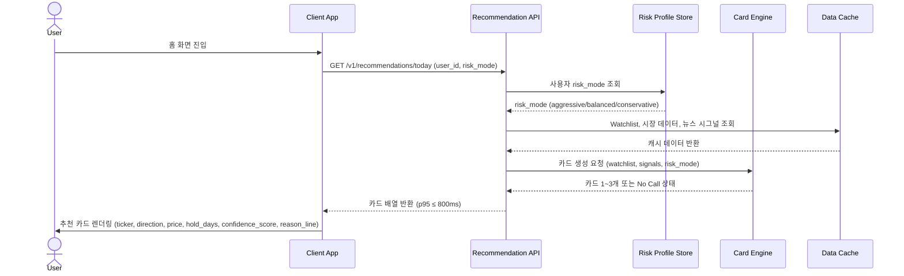
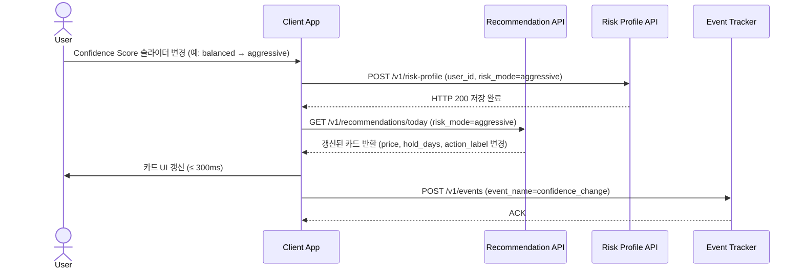
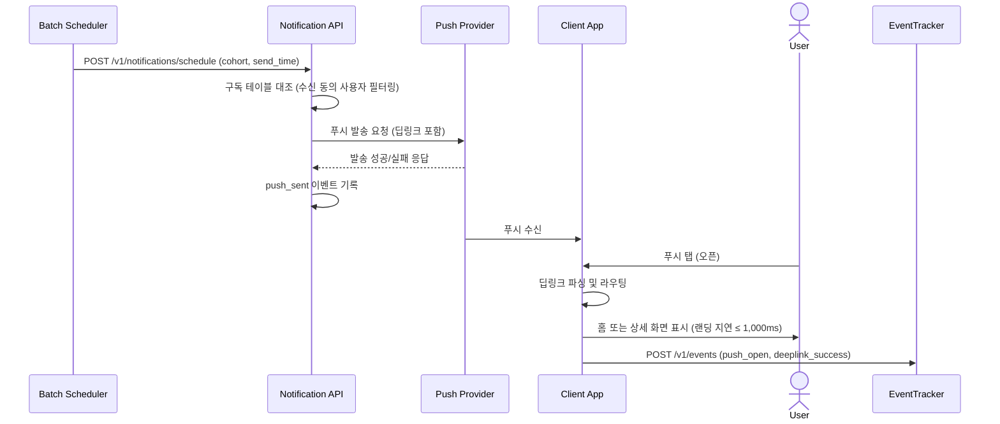
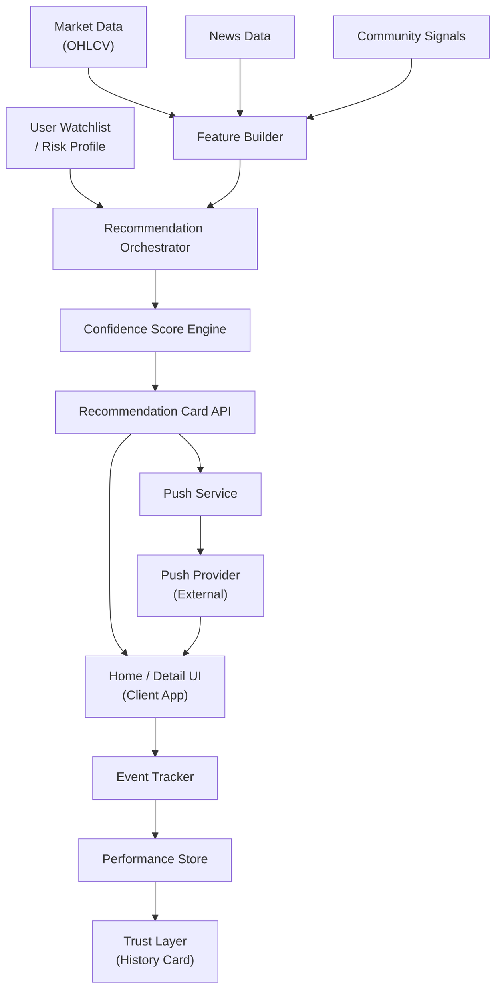
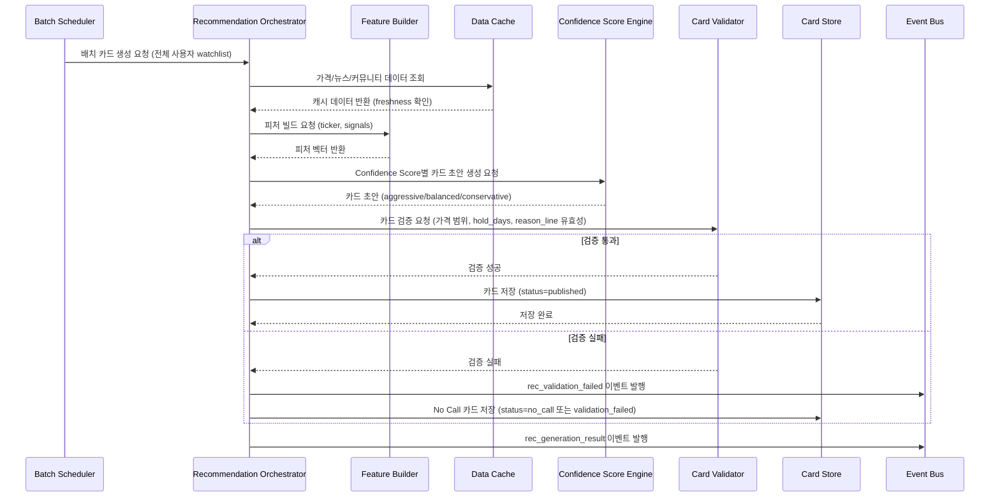
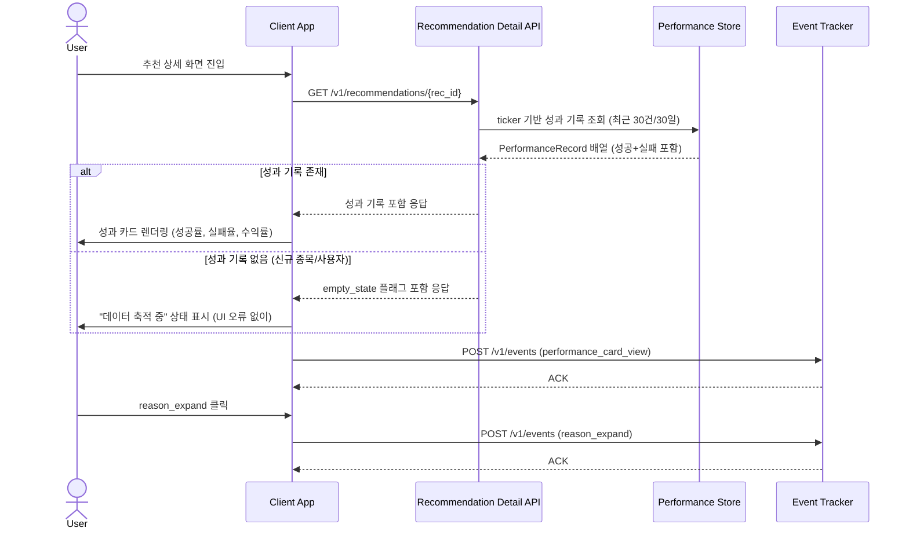
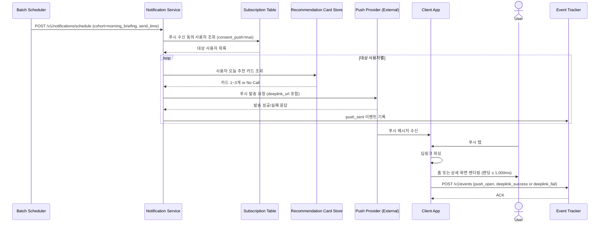
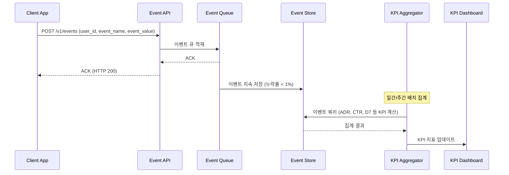

# Software Requirements Specification (SRS)

**Document ID:** SRS-001  
**Revision:** 0.1  
**Date:** 2026-04-15  
**Standard:** ISO/IEC/IEEE 29148:2018  
**Status:** Draft  
**Project:** 미국주식 리스크-맞춤 의사결정 인터페이스 (US Stock Risk-Adaptive Decision Interface)  
**Source PRD:** `us_stock_decision_interface_prd_v1_0.md` (v1.0, 2026-04-14)

---

## 개정 이력 (Revision History)

| 버전 | 날짜 | 작성자 | 변경 내용 |
|---|---|---|---|
| 0.1 | 2026-04-15 | Requirements Engineering (AI) | 최초 작성 — PRD v1.0 기반 |

---

## 목차 (Table of Contents)

1. Introduction  
   1.1 Purpose  
   1.2 Scope  
   1.3 Definitions, Acronyms, Abbreviations  
   1.4 References  
   1.5 Constraints and Assumptions  
2. Stakeholders  
3. System Context and Interfaces  
   3.1 External Systems  
   3.2 Client Applications  
   3.3 API Overview  
   3.4 Interaction Sequences  
4. Specific Requirements  
   4.1 Functional Requirements  
   4.2 Non-Functional Requirements  
5. Traceability Matrix  
6. Appendix  
   6.1 API Endpoint List  
   6.2 Entity & Data Model  
   6.3 Detailed Interaction Models  

---

## 1. Introduction

### 1.1 Purpose

본 SRS는 **미국주식 리스크-맞춤 의사결정 인터페이스** (이하 "시스템")의 소프트웨어 요구사항을 ISO/IEC/IEEE 29148:2018 표준에 따라 명세한 문서이다.

시스템이 해결하려는 핵심 문제는 다음과 같다:

> "정보를 많이 읽고 차트를 오래 봐도, 바쁜 직장인 투자자가 결국 실행 가능한 숫자와 확신을 얻지 못한다."

본 SRS는 다음을 포함한다:
- 기능 요구사항 (Functional Requirements)
- 비기능 요구사항 (Non-Functional Requirements)
- 시스템 인터페이스 정의
- 데이터 모델
- 추적성 매트릭스 (Traceability Matrix)
- 추천 카드 생성, 리스크 성향 설정, 성과 이력 조회, 푸시 알림 발송 등 핵심 흐름의 시퀀스 다이어그램

본 문서의 독자는 개발팀, QA팀, PM, 보안팀, 법무팀, 데이터 엔지니어링팀이다.

---

### 1.2 Scope

#### 1.2.1 In-Scope (v1.0)

| 범위 항목 | 설명 |
|---|---|
| 관심 종목/섹터 기반 온보딩 | 사용자가 최소 1개, 권장 최대 3개의 관심 종목 또는 섹터를 등록하고 수정할 수 있다 |
| 오늘의 추천 카드 (1~3개) | 종목명(ticker), 방향(direction), 가격(entry/target), 기간(hold_days), 신뢰도(confidence_score), 한 줄 이유(reason_line) 포함 카드 제공 |
| 매수/매도 가격 및 보유 기간 제안 | 진입가 또는 진입 범위, 청산가 또는 청산 범위, 1~10일 정수 horizon |
| Confidence Score 선택 UI | 공격형/중립형/안정형 3단계, 선택 시 카드 출력값 동적 반영 |
| 최근 예측 기록 / 성과 카드 | 최근 30건 또는 30일, 성공·실패 모두 포함 |
| 한 줄 이유 설명 | 160자 이하 비어 있지 않은 문자열, 카드 1장당 1개 원칙 |
| 아침 브리핑 푸시 알림 | 하루 1회 핵심 추천 알림, 딥링크 포함 |
| 리스크 프로필 저장 및 복원 | 세션 간 risk_mode 유지 |
| 행동 이벤트 추적 | 추천 카드 노출·클릭·저장·알림 설정·브로커 이동·가격 복사 이벤트 수집 |
| KPI 대시보드용 데이터 파이프라인 | ADR, CTR, 리텐션 등 핵심 지표 집계 |

#### 1.2.2 Out-of-Scope (v1.0)

| 배제 항목 | 배제 근거 |
|---|---|
| 자동 주문 실행 (브로커 계좌 직접 연동) | ADR-001/003: MVP JTBD 검증 이전 |
| 실시간 틱(tick) 단위 시그널 | ADR-003: 3~5일 Horizon 고정 정책 |
| 커뮤니티/UGC (전략 공유, 토론) | ADR-001/004: 복잡도 증가, 신뢰 리스크 |
| 심층 포트폴리오 최적화 | MVP 범위 초과 |
| 장문의 Explainable AI 대시보드 | ADR-004: 차트/지표 배제 원칙 |
| 전문가 콘텐츠 / 리딩방 기능 | ADR-001과 충돌 |
| 캔들 차트, RSI, MACD 등 원본 차트 위젯 노출 | ADR-004 |

---

### 1.3 Definitions, Acronyms, Abbreviations

| 용어 | 정의 |
|---|---|
| **ADR (Actionable Decision Rate)** | 24시간 내 actionable_event 발생 사용자 수 / rec_card_view 사용자 수. 북극성 KPI(NS-01). |
| **actionable_event** | 다음 중 1개 이상 발생: bookmark_add, alert_set, broker_redirect, price_copy, execution_intent_submit |
| **Confidence Score** | 사용자가 직접 선택하는 리스크 성향 단계. 공격형(aggressive) / 중립형(balanced) / 안정형(conservative) 3단계. |
| **Decision Layer** | 정보 제공이 아닌, 실행 가능한 의사결정 카드를 출력하는 제품 레이어(ADR-001). |
| **Direction** | 추천 카드의 매매 방향. BUY 또는 SELL. |
| **Hold Days** | 추천 보유 기간. 1~10일 정수값. |
| **No Call** | 입력 데이터 부족으로 추천 카드를 생성하지 못하는 상태. 상태 카드 1장 또는 안내 문구로 대체. |
| **Performance Record** | 과거 추천에 대한 실제 수익률 및 적중 여부를 포함한 이력 데이터. |
| **PRD** | Product Requirements Document. 본 SRS의 Source of Truth. |
| **Reason Line** | 추천 카드에 포함되는 1문장 이유 설명. 최대 160자. |
| **Recommendation Card** | 시스템의 핵심 출력 단위. ticker, direction, entry_price, target_price, hold_days, confidence_score, reason_line으로 구성. |
| **Risk Mode** | 사용자 선택 리스크 성향 값. aggressive / balanced / conservative 중 하나. |
| **SLA** | Service Level Agreement. 서비스 가용성 보장 수준. |
| **SRS** | Software Requirements Specification. 본 문서. |
| **Trust Layer** | 실패를 포함한 예측 성과 기록을 공개하여 신뢰를 형성하는 제품 레이어(ADR-005). |
| **Watchlist** | 사용자가 등록한 관심 종목 및 섹터 목록. |
| **AOS** | Adjusted Opportunity Score. JTBD 탐색 과정에서 도출된 기회 점수. |
| **JTBD** | Jobs to be Done. 사용자가 제품을 통해 완수하려는 과업. |
| **KPI** | Key Performance Indicator. |
| **MoSCoW** | Must / Should / Could / Won't 우선순위 분류 체계. |
| **NFR** | Non-Functional Requirement. |
| **p95** | 95번째 백분위수 응답 시간. |
| **RBAC** | Role-Based Access Control. |
| **RPO** | Recovery Point Objective. 장애 발생 시 허용 가능한 데이터 유실 시점. |
| **RTO** | Recovery Time Objective. 장애 발생 후 서비스 복구 목표 시간. |
| **RUM** | Real User Monitoring. 실제 사용자 브라우저/앱 성능 측정. |
| **TLS** | Transport Layer Security. |
| **UGC** | User-Generated Content. |
| **VPS** | Value Proposition & MVP Feature Map. 본 PRD의 상위 전략 문서. |

---

### 1.4 References

| REF ID | 문서명 | 버전 | 비고 |
|---|---|---|---|
| REF-01 | 미국주식 리스크-맞춤 의사결정 인터페이스 PRD | v1.0 (2026-04-14) | 본 SRS의 Source of Truth |
| REF-02 | Value Proposition & MVP Feature Map | — | `value_proposition_mvp_feature_map.md` |
| REF-03 | Decision Layer Product ADR | v0.1 | `decision_layer_product_adr_v0_1.md` (ADR-001~005) |
| REF-04 | KPI Dashboard Spec | v0.1 (작성 예정) | `analytics/kpi_dashboard_v0.1` |
| REF-05 | Experiment Tracker | v0.2 (작성 예정) | `experiments/decision_layer_beta_v0.2` |
| REF-06 | ISO/IEC/IEEE 29148:2018 | 2018 | Systems and software engineering — Life cycle processes — Requirements engineering |
| REF-07 | 문제 정의 문서 | — | `5.problem_statements.md` |
| REF-08 | KSF 분석 문서 | — | `4.ksfs.md` |
| REF-09 | 가치사슬 분석 | — | `3.value_chain.md` |
| REF-10 | 경쟁사 분석 | — | `2.competitor_analysis_ai_stocks.md` |

---

### 1.5 Constraints and Assumptions

#### 1.5.1 아키텍처 제약 (ADR 기반)

| 제약 ID | 출처 | 제약 내용 |
|---|---|---|
| CON-001 | ADR-001 | 시스템의 핵심 출력은 정보 요약이 아닌 실행 가능한 행동 카드(Recommendation Card)이어야 한다. |
| CON-002 | ADR-002 | Confidence Score는 공격형/중립형/안정형 3단계 선택형 UX로 구현하며, 단순 배지(badge)로 단순화해서는 안 된다. |
| CON-003 | ADR-003 | 추천 예측 범위(Horizon)는 3~5 영업일로 제한한다. 실시간 초단타 시그널은 v1.0에서 제공하지 않는다. |
| CON-004 | ADR-004 | 메인 폴드 영역에서 캔들 차트, RSI, MACD 등 원본 차트 위젯은 노출하지 않는다. |
| CON-005 | ADR-005 | 성과 기록은 실패를 포함하여 공개한다. 실패 기록을 비노출하는 설계는 예외 승인 없이 반영할 수 없다. |
| CON-006 | REF-01 §6.4 | v1.0에서는 브로커 주문 API와 직접 연동하지 않는다. |
| CON-007 | REF-01 §6.4 | 가격/뉴스/커뮤니티 데이터는 지연 허용 범위 내 캐시를 사용한다. |
| CON-008 | REF-01 §5.3 | 실제 브로커 계좌·주문 권한은 v1.0에서 저장하거나 연동하지 않는다. |

#### 1.5.2 보안 제약

| 제약 ID | 제약 내용 |
|---|---|
| CON-009 | 모든 외부 및 내부 API는 TLS를 강제 적용한다. |
| CON-010 | API 키와 토큰은 시크릿 매니저에 보관하며, 코드 또는 로그에 평문으로 기록하지 않는다. |
| CON-011 | 사용자 식별자와 이벤트 저장소는 저장 시 암호화를 적용한다. |
| CON-012 | 운영/분석 콘솔은 RBAC를 적용하며 프로덕션 쓰기 권한은 최소 2인 이하로 제한한다. |

#### 1.5.3 가정 (Assumptions)

| 가정 ID | 가정 내용 |
|---|---|
| ASS-001 | 사용자는 장문의 리서치보다 요약된 실행 카드를 더 선호한다. |
| ASS-002 | 1~3개의 추천 카드가 5개 이상의 추천보다 전환율이 높다. |
| ASS-003 | 리스크 성향 조작 경험이 신뢰와 재방문에 긍정적 영향을 준다. |
| ASS-004 | 실패 이력을 포함해도 오히려 신뢰 형성에 도움이 된다. |
| ASS-005 | 베타 참여자 200명은 기존 미국주식 투자 관심 사용자이다. |
| ASS-006 | 외부 가격/뉴스/커뮤니티 데이터 소스는 지연 허용형 캐시로 공급된다. |
| ASS-007 | 푸시 발송 인프라는 모바일 웹 푸시 공급자를 통해 제공된다. |
| ASS-008 | 사용자 인증은 이메일 또는 소셜 로그인 방식으로 제공된다. |

---

## 2. Stakeholders

| 역할 (Role) | 대표 페르소나 | 책임 (Responsibility) | 관심사 (Interest) |
|---|---|---|---|
| **바쁜 직장인 서학개미** | 한국 거주, 미국장 실시간 대응 어려움, 예약주문 사용 | 아침 브리핑 활용, 관심 종목 등록, 추천 카드 기반 주문 준비 | 탐색 시간 단축, 아침 브리핑, 예약주문 가능 숫자 |
| **준경험 투자자** | 뉴스/유튜브 시청, 차트 해석 미숙 | 추천 카드 열람, 방향·가격·기간 확인, Confidence Score 조작 | 차트 없이 결과 이해, 가격·기간 명시 |
| **불신형 유료 독자** | 리딩방/유튜버 경험, 맹신 거부 | 성과 이력 열람, 실패 기록 확인, 한 줄 이유 확인 | 성과 이력 공개, 실패 기록 포함, 확률·이유 |
| **Product Manager** | — | PRD 관리, KPI 목표 설정, 범위 조정 | NS-01 ADR 달성, 실험 결과 |
| **Backend Developer** | — | API 구현, 추천 엔진 연동, 이벤트 추적 | API p95 준수, 생성 실패율 |
| **Frontend / App Developer** | — | 카드 렌더링, Confidence Score UI, 딥링크 | 렌더링 p95, 프런트 오류율 |
| **Data Engineer** | — | 데이터 파이프라인, 이벤트 저장, KPI 집계 | 데이터 freshness, 누락률 |
| **QA Engineer** | — | AC 기반 테스트, 회귀 테스트, 스키마 검증 | AC 100% 충족 |
| **Security Officer** | — | 보안 정책 시행, 권한 감사, 취약점 대응 | TLS, RBAC, 감사 로그 |
| **Legal / Compliance** | — | 투자 자문 오해 방지 문구 검토 | 법무 문구, 책임 제한 |
| **Marketing / Growth** | — | 푸시 알림 채널 운영, 베타 채널 관리 | 푸시 오픈율, 딥링크 성공률 |

---

## 3. System Context and Interfaces

### 3.1 External Systems

| 외부 시스템 | 유형 | 제공 데이터 | 연동 방식 | 제약 |
|---|---|---|---|---|
| Market Data Provider | 외부 데이터 소스 | OHLCV (시가/고가/저가/종가/거래량) | REST/WebSocket + 캐시 | 지연 허용 범위 내 캐시 사용, 10분 이상 지연 시 경보 |
| News Data Provider | 외부 데이터 소스 | 종목/섹터 관련 뉴스, 감성 점수 | REST + 캐시 | 결측률 3% 초과 시 경보 |
| Community Signal Provider | 외부 데이터 소스 | 소셜/커뮤니티 시그널 점수 | REST + 캐시 | 지연 허용형 캐시 |
| Push Notification Provider | 외부 인프라 | 모바일 웹 푸시 발송 | REST API | 발송 성공률 ≥ 99%, 발송 예약 시각 대비 5분 이내 |
| Auth Provider | 외부 인프라 | 이메일/소셜 로그인, 세션 토큰 | OAuth2 / OIDC | 사용자 식별, 세션 관리 |
| Secret Manager | 내부 인프라 | API 키, 토큰 보관 | SDK | 코드/로그 평문 금지 |

### 3.2 Client Applications

| 클라이언트 | 플랫폼 | 통신 방식 | 비고 |
|---|---|---|---|
| Web App | PC/모바일 브라우저 | HTTPS REST | 추천 카드, Confidence Score UI, 성과 카드 |
| Mobile Web | 모바일 브라우저 | HTTPS REST + Push | 아침 브리핑 푸시 수신, 딥링크 랜딩 |

### 3.3 API Overview

| API Endpoint | 메서드 | 유형 | 설명 | p95 요구사항 |
|---|---|---|---|---|
| `/v1/recommendations/today` | GET | 내부/앱 | 오늘의 추천 카드 1~3개 조회 | ≤ 800ms |
| `/v1/recommendations/{rec_id}` | GET | 내부/앱 | 추천 상세 (이유, 성과, 유사 패턴) 조회 | ≤ 700ms (렌더) |
| `/v1/risk-profile` | POST | 내부/앱 | 리스크 성향 저장 | ≤ 1,000ms |
| `/v1/events` | POST | 내부/앱 | 행동 이벤트 추적 수집 | — (누락률 < 1%) |
| `/v1/notifications/schedule` | POST | 내부/배치 | 푸시 알림 예약 발송 | 예약 대비 5분 이내 |
| `/v1/performance/history` | GET | 내부/앱 | 최근 30건/30일 성과 이력 조회 | — |
| `/v1/market-ingestion/health` | GET | 내부/운영 | 데이터 소스 freshness 및 결측률 확인 | — |

### 3.4 Interaction Sequences (핵심 시퀀스 다이어그램)

#### 3.4.1 추천 카드 조회 핵심 흐름

#### 3.4.2 Confidence Score 변경 흐름

#### 3.4.3 아침 브리핑 푸시 발송 흐름

---

## 4. Specific Requirements

### 4.1 Functional Requirements

> - **형식:** REQ-FUNC-xxx  
> - **Source:** 매핑된 User Story 및 PRD 섹션  
> - **Priority:** MoSCoW (M=Must, S=Should, C=Could, W=Won't)  
> - **AC:** Given/When/Then 형식의 인수 기준  

---

#### F1. 관심 종목/섹터 온보딩

| REQ ID | 요구사항 설명 | Priority | Source | Acceptance Criteria |
|---|---|---|---|---|
| REQ-FUNC-001 | 시스템은 사용자가 관심 종목 또는 섹터를 최소 1개, 최대 3개까지 등록할 수 있도록 온보딩 UI를 제공해야 한다. | M | PRD §4.1 Must | **Given** 신규 사용자가 온보딩 화면에 진입했을 때 **When** 관심 종목/섹터를 1개 선택하면 **Then** 시스템은 watchlist에 해당 항목을 저장하고 홈으로 이동해야 한다. |
| REQ-FUNC-002 | 시스템은 온보딩 중 관심 종목/섹터를 3개 초과 선택 시도 시, 추가 선택을 차단하고 사용자에게 명시적 안내 메시지를 표시해야 한다. | M | PRD §4.1 Must | **Given** 사용자가 이미 3개를 선택한 상태에서 **When** 추가 항목을 선택 시도하면 **Then** 시스템은 선택을 차단하고 "최대 3개까지 선택 가능합니다" 안내를 표시해야 한다. |
| REQ-FUNC-003 | 시스템은 온보딩 이후에도 사용자가 관심 종목/섹터를 수정할 수 있는 UI를 제공해야 한다. | M | PRD §4.1 Must | **Given** 기존 관심 종목이 등록된 사용자가 **When** 설정 화면에서 종목을 변경하면 **Then** watchlist가 갱신되며, 다음 추천 카드 생성 시 변경된 watchlist가 반영되어야 한다. |

---

#### F2. 오늘의 추천 카드 생성 및 노출

| REQ ID | 요구사항 설명 | Priority | Source | Acceptance Criteria |
|---|---|---|---|---|
| REQ-FUNC-010 | 시스템은 홈 화면 진입 시 추천 카드를 최대 3개 이하로 반환해야 한다. | M | Story 1, PRD §4.1 Must | **Given** 사용자가 관심 종목을 1개 이상 저장했고 **When** 홈 화면에 진입하면 **Then** 추천 카드 API는 3개 이하 카드를 반환하며, 응답 p95는 800ms 이하이어야 한다. |
| REQ-FUNC-011 | 추천 카드의 각 항목에는 `ticker`, `direction`, `confidence_score` 필드가 100% 포함되어야 한다. | M | Story 1 AC1-3, PRD §4.1 Must | **Given** 추천 카드가 생성되었고 **When** 홈 UI에 렌더링되면 **Then** 카드 1장당 ticker, direction, confidence_score 필드는 null 또는 빈 값이 없어야 한다. |
| REQ-FUNC-012 | 추천 카드에는 `direction`, `entry_price 또는 entry_range`, `hold_days`, `confidence_score`, `reason_line`이 모두 표시되어야 한다. | M | Story 2 AC2-1, PRD §4.1 Must | **Given** 카드가 정상 생성되었고 **When** 사용자가 추천 카드를 보면 **Then** direction, entry_price 또는 entry_range, hold_days, confidence_score, reason_line 5개 필드가 모두 표시되어야 한다. |
| REQ-FUNC-013 | 데이터 부족으로 추천 카드를 생성할 수 없는 경우, 시스템은 빈 카드 대신 No Call 상태 카드 또는 안내 문구를 반환해야 하며 HTTP 5xx를 발생시키지 않아야 한다. | M | Story 1 AC1-2 | **Given** 가격 또는 뉴스 입력이 최소 생성 조건을 만족하지 못했고 **When** 추천 카드 생성을 시도하면 **Then** 시스템은 No Call 상태 카드 1장 또는 대체 안내 문구를 반환하며 HTTP 5xx를 발생시키지 않아야 한다. |
| REQ-FUNC-014 | 메인 폴드 영역에는 캔들 차트, RSI, MACD 등 원본 차트 위젯이 노출되지 않아야 한다. | M | Story 2 AC2-3, ADR-004 | **Given** v1.0 범위에서 상세 화면이 열렸고 **When** 사용자가 추천 상세를 확인하면 **Then** 메인 폴드 영역에 캔들 차트, RSI, MACD 위젯이 렌더링되지 않아야 한다. (디자인 QA 체크리스트, 시각 회귀 테스트로 확인) |

---

#### F3. 가격 및 보유 기간 제안

| REQ ID | 요구사항 설명 | Priority | Source | Acceptance Criteria |
|---|---|---|---|---|
| REQ-FUNC-020 | 추천 카드는 `entry_price`와 `target_price` 또는 `entry_range`와 `target_range` 중 하나를 반드시 포함해야 하며, `hold_days`는 1~10의 정수값이어야 한다. | M | Story 3 AC3-1, PRD §4.1 Must | **Given** 추천 카드가 생성되었고 **When** 사용자에게 노출되면 **Then** entry_price+target_price 또는 entry_range+target_range 중 하나가 반드시 있고, hold_days는 1~10 정수이어야 한다. |
| REQ-FUNC-021 | 가격 산출값이 0 이하이거나 비정상 급등락 범위로 판정된 카드는 게시되지 않아야 하며, `rec_validation_failed` 이벤트가 기록되어야 한다. | M | Story 3 AC3-2 | **Given** 입력 데이터 이상으로 가격이 0 이하 또는 비정상 범위로 산출되었고 **When** 카드 게시 전 검증을 수행하면 **Then** 해당 카드는 게시되지 않고 rec_validation_failed 이벤트가 기록되어야 한다. |
| REQ-FUNC-022 | 사용자가 가격 복사(price_copy) 버튼을 누르면 해당 가격 문자열이 클립보드에 복사되며, 이벤트 로그가 기록되어야 한다. | M | Story 3 AC3-3 | **Given** 사용자가 가격 복사 버튼을 눌렀고 **When** 시스템이 요청을 처리하면 **Then** 클릭 후 응답 시간은 1초 이하이고, price_copy 이벤트 누락률은 1% 미만이어야 한다. |
| REQ-FUNC-023 | 사용자가 브로커 이동(broker_redirect) 버튼을 누르면 지정된 브로커 앱/웹으로 이동하며, 이벤트 로그가 기록되어야 한다. | M | Story 3 AC3-3 | **Given** 사용자가 브로커 이동 버튼을 눌렀고 **When** 시스템이 요청을 처리하면 **Then** 클릭 후 응답 시간은 1초 이하이고, broker_redirect 이벤트 누락률은 1% 미만이어야 한다. |

---

#### F4. Confidence Score 선택 UI

| REQ ID | 요구사항 설명 | Priority | Source | Acceptance Criteria |
|---|---|---|---|---|
| REQ-FUNC-030 | 시스템은 공격형(aggressive) / 중립형(balanced) / 안정형(conservative) 3단계 이상의 Confidence Score 선택 UI를 제공해야 한다. | M | Story 4, PRD §4.1 Must, ADR-002 | **Given** 사용자가 추천 카드 화면에 진입했고 **When** Confidence Score UI가 렌더링되면 **Then** 선택 가능한 옵션은 aggressive, balanced, conservative 3가지 이상 표시되어야 한다. |
| REQ-FUNC-031 | Confidence Score 변경 시, `price`, `hold_days`, `action_label` 중 최소 1개 이상의 카드 출력값이 변경되고, UI 반영 시간은 300ms 이하이어야 한다. | M | Story 4 AC4-1, ADR-002 | **Given** 사용자가 Confidence Score를 변경했고 **When** 카드 출력값이 갱신되면 **Then** price, hold_days, action_label 중 최소 1개가 변경되고 UI 반영 시간이 300ms 이하이어야 한다. |
| REQ-FUNC-032 | 사용자가 risk_mode를 저장하면, 다음 세션 홈 재진입 시 저장된 값이 기본 선택값으로 복원되어야 한다. | S | Story 4 AC4-2, PRD §4.1 Should | **Given** 사용자가 risk_mode를 저장했고 **When** 다음 세션에서 홈에 재진입하면 **Then** 저장된 risk_mode 값이 기본 선택값으로 복원되어야 한다. |
| REQ-FUNC-033 | API에 허용되지 않은 risk_mode 값이 전달된 경우, 서버는 HTTP 400과 명시적 오류 코드를 반환하며 기존 저장값을 변경하지 않아야 한다. | M | Story 4 AC4-3 | **Given** API에 허용되지 않은 risk_mode 값이 전달되었고 **When** 서버가 저장 요청을 받으면 **Then** 서버는 HTTP 400과 명시적 오류 코드를 반환하며, 기존 저장값은 변경되지 않아야 한다. |

---

#### F5. 한 줄 이유 설명 및 성과 이력 (Trust Layer)

| REQ ID | 요구사항 설명 | Priority | Source | Acceptance Criteria |
|---|---|---|---|---|
| REQ-FUNC-040 | 추천 카드가 게시 상태일 때, `reason_line`은 160자 이하의 비어 있지 않은 문자열이어야 한다. | M | Story 5 AC5-1, PRD §4.1 Must, ADR-005 | **Given** 추천 카드가 게시 대상 상태이고 **When** 카드가 렌더링되면 **Then** reason_line은 길이가 1 이상 160 이하인 문자열이어야 하며 null 또는 공백만으로 구성되어서는 안 된다. |
| REQ-FUNC-041 | 성과 기록 조회 시, 최근 30건 또는 최근 30일 이내 데이터를 반환하며, 성공·실패 결과가 모두 있는 경우 둘 다 표시해야 한다. | M | Story 5 AC5-2, ADR-005 | **Given** 사용자가 상세 화면에서 성과 기록을 요청했고 **When** 기록을 조회하면 **Then** 최근 30건 또는 30일 이내 데이터를 반환하며, 성공/실패 결과가 모두 존재할 경우 둘 다 표시되어야 한다. |
| REQ-FUNC-042 | 성과 기록이 부족한 경우(신규 사용자/신규 종목), 빈 표 대신 "데이터 축적 중" 상태를 표시해야 하며 UI 오류를 발생시키지 않아야 한다. | M | Story 5 AC5-3 | **Given** 성과 기록이 부족하고 **When** 성과 카드 영역을 열면 **Then** 시스템은 "데이터 축적 중" 상태를 표시하며, UI 오류를 발생시키지 않아야 한다. |
| REQ-FUNC-043 | 시스템은 유사 패턴 참고 기능(Could)으로, 과거 유사 시그널 요약을 추천 상세 화면에 제공할 수 있다. (v1.0 선택 구현) | C | PRD §4.1 Could | **Given** 유사 패턴 데이터가 존재하고 **When** 사용자가 추천 상세를 열면 **Then** 유사 패턴 요약이 표시되거나 해당 섹션이 조용히 숨겨져야 한다. |

---

#### F6. 아침 브리핑 푸시 알림

| REQ ID | 요구사항 설명 | Priority | Source | Acceptance Criteria |
|---|---|---|---|---|
| REQ-FUNC-050 | 시스템은 푸시 수신에 동의한 사용자에게 미국장 전 지정 발송 시간 기준 ±5분 이내로 브리핑 푸시를 발송해야 한다. | S | Story 6 AC6-1, PRD §4.1 Should | **Given** 사용자가 푸시 수신에 동의했고 **When** 미국장 전 지정 발송 시간이 도달하면 **Then** 푸시는 예약 시각 대비 5분 이내 발송되고 발송 성공률은 99% 이상이어야 한다. |
| REQ-FUNC-051 | 사용자가 푸시를 탭하면, 추천 카드가 있는 홈 화면 또는 지정된 상세 화면으로 딥링크가 동작해야 한다. | S | Story 6 AC6-2 | **Given** 사용자가 푸시를 열었고 **When** 앱 또는 웹으로 진입하면 **Then** 추천 카드 홈 또는 지정 상세 화면으로 이동해야 하며, 딥링크 실패율은 1% 미만이어야 한다. |
| REQ-FUNC-052 | 푸시 수신을 거부했거나 OS 권한을 회수한 사용자는 발송 대상에서 제외되어야 하며, 잘못 발송된 메시지 비율은 0%이어야 한다. | M | Story 6 AC6-3 | **Given** 사용자가 푸시 수신을 거부했거나 OS 권한을 회수했고 **When** 발송 배치를 실행하면 **Then** 해당 사용자는 발송 대상에서 제외되어야 하며, 잘못 발송된 메시지 비율은 0%이어야 한다. |

---

#### F7. 행동 이벤트 추적 및 KPI 집계

| REQ ID | 요구사항 설명 | Priority | Source | Acceptance Criteria |
|---|---|---|---|---|
| REQ-FUNC-060 | 시스템은 다음 이벤트를 클라이언트에서 서버로 전송하고 기록해야 한다: `home_view`, `rec_card_impression`, `rec_card_click`, `rec_detail_view`, `bookmark_add`, `alert_set`, `broker_redirect`, `price_copy`, `execution_intent_submit`, `confidence_view`, `confidence_change`, `performance_card_view`, `reason_expand`, `push_sent`, `push_open`, `deeplink_success`, `deeplink_fail`, `rec_validation_failed`, `risk_profile_load_result`. | M | PRD §1.1, §1.2, §3.x | **Given** 사용자가 해당 행동을 수행했고 **When** 이벤트가 클라이언트에서 발행되면 **Then** 이벤트는 1% 미만 누락률로 서버에 기록되어야 한다. |
| REQ-FUNC-061 | 시스템은 이벤트 기반으로 NS-01 ADR, SU-01~SU-08 보조 KPI를 일간/주간 집계하여 KPI 대시보드에 제공해야 한다. | S | PRD §1.2, §5.4 | **Given** 이벤트 로그가 수집되고 **When** KPI 집계 배치가 실행되면 **Then** ADR, 추천 카드 CTR, First Decision Time, Confidence Engagement Rate, D7/D30 Retention 등 정의된 KPI가 집계되어야 한다. |

---

#### F8. 추천 이력 아카이브

| REQ ID | 요구사항 설명 | Priority | Source | Acceptance Criteria |
|---|---|---|---|---|
| REQ-FUNC-070 | 시스템은 종목별 과거 추천 결과 목록을 조회할 수 있는 UI 및 API를 제공해야 한다. | S | PRD §4.1 Should | **Given** 사용자가 특정 ticker의 추천 이력을 조회하면 **When** `/v1/performance/history`가 호출되면 **Then** 해당 ticker의 추천 결과(hit_flag, realized_return 포함)가 최신순으로 반환되어야 한다. |

---

### 4.2 Non-Functional Requirements

#### 4.2.1 성능 (Performance)

| REQ ID | 항목 | 요구사항 | 측정 조건 | 경보 기준 | Source |
|---|---|---|---|---|---|
| REQ-NF-001 | 홈 추천 카드 API p95 응답 | `GET /v1/recommendations/today` 응답 지연 ≤ 800ms | 5분 이동 창 | 15분 연속 초과 시 경보 | PRD §5.1, Story 1 AC1-1, NS-01 측정 경로 |
| REQ-NF-002 | 추천 상세 화면 p95 렌더링 | 최초 렌더 시간 ≤ 700ms | 15분 이동 창 | 30분 연속 초과 시 경보 | PRD §5.1, Story 2 AC2-2 |
| REQ-NF-003 | Confidence Score 슬라이더 UI 반영 지연 | 값 변경 후 UI 반영 완료까지 ≤ 300ms | 세션 단위 샘플링 | 5% 초과 세션에서 초과 시 경보 | PRD §5.1, Story 4 AC4-1 |
| REQ-NF-004 | 알림 클릭 후 랜딩 지연 | 푸시 클릭부터 홈/상세 표시까지 ≤ 1,000ms | 15분 이동 창 | 15분 연속 초과 시 경보 | PRD §5.1, Story 6 AC6-2 |
| REQ-NF-005 | 프런트엔드 오류율 | 추천 카드 상세 화면 프런트 에러율 < 0.5% | 15분 이동 창 | 0.5% 초과 시 경보 | PRD §5.1, Story 2 AC2-2 |
| REQ-NF-006 | 리스크 성향 저장 반영 시간 | POST /v1/risk-profile 후 카드 갱신까지 ≤ 1,000ms | API 호출 단위 | 5% 초과 세션 초과 시 경보 | PRD §6.3, Story 4 AC4-2 |
| REQ-NF-007 | 가격 복사/브로커 이동 응답 시간 | 클릭 후 응답 시간 ≤ 1,000ms | 클라이언트 ACK 로그 | 이벤트 누락률 1% 초과 시 경보 | Story 3 AC3-3 |

#### 4.2.2 가용성 / 신뢰성 (Availability / Reliability)

| REQ ID | 항목 | 요구사항 | 측정 창 | 경보 기준 | Source |
|---|---|---|---|---|---|
| REQ-NF-010 | 월 서비스 가용성 (SLA) | 월 단위 Uptime ≥ 99.5% | 월간 | 월중 예상치 99.5% 미만 시 운영 경보 | PRD §5.2 |
| REQ-NF-011 | RPO (Recovery Point Objective) | 장애 발생 시 허용 가능한 데이터 유실 시점 ≤ 1시간 | 장애 발생 시 | 초과 시 운영 보고 | ISO 29148 신뢰성 기준 |
| REQ-NF-012 | RTO (Recovery Time Objective) | 장애 발생 후 서비스 복구 목표 시간 ≤ 4시간 | 장애 발생 시 | 초과 시 운영 보고 | ISO 29148 신뢰성 기준 |
| REQ-NF-013 | 추천 카드 생성 실패율 | < 1.0% | 1시간 이동 창 | 10분 연속 1% 초과 시 경보 | PRD §5.2 |
| REQ-NF-014 | 이벤트 추적 누락률 | 클라이언트 발행 대비 서버 적재 실패 < 1.0% | 일간 | 일 단위 1% 초과 시 데이터 경보 | PRD §5.2 |
| REQ-NF-015 | 푸시 발송 성공률 | 발송 시도 대비 공급자 성공 응답 ≥ 99.0% | 1회 배치 단위 | 배치당 99% 미만 시 경보 | PRD §5.2, Story 6 AC6-1 |
| REQ-NF-016 | No Call 비율 | 데이터 부족으로 카드 미생성 비율 ≤ 15% | 일간 | 2일 연속 초과 시 분석 리뷰 | PRD §5.2, §6.4 |

#### 4.2.3 보안 (Security)

| REQ ID | 항목 | 요구사항 | 감사/측정 기준 | Source |
|---|---|---|---|---|
| REQ-NF-020 | 전송 암호화 | 모든 외부 및 내부 API는 TLS 1.2 이상 강제 적용 | 월간 트래픽 샘플 점검 | PRD §5.3, CON-009 |
| REQ-NF-021 | 저장 암호화 | 사용자 식별자 및 이벤트 저장소는 AES-256 이상 저장 암호화 적용 | 보안 점검 체크리스트 | PRD §5.3, CON-011 |
| REQ-NF-022 | 시크릿 관리 | API 키 및 토큰은 시크릿 매니저에 보관, 코드/로그 평문 기록 금지 | 배포 파이프라인 스캔 | PRD §5.3, CON-010 |
| REQ-NF-023 | 접근 제어 (RBAC) | 운영/분석 콘솔은 RBAC 적용, 프로덕션 쓰기 권한 최대 2인 이하 | 권한 감사 월 1회 | PRD §5.3, CON-012 |
| REQ-NF-024 | 개인정보 최소 수집 | 이메일/소셜 로그인 식별자, 관심 종목, 성향만 저장 | 데이터 맵 분기별 검토 | PRD §5.3 |
| REQ-NF-025 | 로그 보관 정책 | 이벤트 로그 13개월, 원문 입력 90일, 이후 집계치만 보관 | 스토리지 만료 정책 검토 | PRD §5.3 |
| REQ-NF-026 | 민감 데이터 제한 | v1.0에서 실제 브로커 계좌·주문 권한은 저장 및 연동 금지 | 스키마 리뷰 | PRD §5.3, CON-008 |

#### 4.2.4 비용 (Cost)

| REQ ID | 항목 | 요구사항 | 측정 기준 | Source |
|---|---|---|---|---|
| REQ-NF-030 | 추천 카드 1건 생성 단가 | ≤ ₩100 (변동 원가 기준) | 배치 비용 리포트 (14일 주기) | PRD §5.3, BM-07 |
| REQ-NF-031 | 월 사용자당 AI 추론비 | ≤ ₩3,000 | 월간 원가 리포트 | PRD §5.3 |

#### 4.2.5 운영 및 모니터링 (Operations & Monitoring)

| REQ ID | 항목 | 요구사항 | 대시보드 소스 | 경보 기준 | Source |
|---|---|---|---|---|---|
| REQ-NF-040 | 제품 KPI 모니터링 | ADR, 카드 CTR, Confidence Engagement Rate, 성과 카드 열람률 실시간 집계 | Product KPI Dashboard | 기준선 대비 20% 이상 급락 24시간 지속 시 PM/분석 리뷰 | PRD §5.4 |
| REQ-NF-041 | 기술 모니터링 | API p95, HTTP 5xx 비율, 추천 생성 실패율 | APM / Service Dashboard | p95 기준 초과 또는 5xx > 1% 15분 지속 시 백엔드 온콜 | PRD §5.4 |
| REQ-NF-042 | 데이터 freshness 모니터링 | 가격/뉴스 수집 지연, 결측률 | Data Freshness Dashboard | 지연 10분 초과 또는 결측률 3% 초과 시 데이터 엔지니어 경보 | PRD §5.4 |
| REQ-NF-043 | 푸시 운영 모니터링 | 발송 성공률, 오픈율, 딥링크 실패율 | Push Ops Dashboard | 성공률 99% 미만 또는 딥링크 실패율 1% 초과 시 마케팅/앱 온콜 | PRD §5.4 |
| REQ-NF-044 | 보안 모니터링 | 비정상 접근, 권한 상승, 비밀 노출 탐지 | Security Audit Dashboard | 고심각도 이벤트 1건 이상 발생 시 보안 책임자 즉시 대응 | PRD §5.4 |

#### 4.2.6 확장성 (Scalability)

| REQ ID | 항목 | 요구사항 | Source |
|---|---|---|---|
| REQ-NF-050 | 추천 카드 생성 처리량 | Closed Beta 200명 기준, 장 시작 전 배치 완료 시간 내 전체 유저 카드 생성 완료 | PRD §8.1, §6.3 |
| REQ-NF-051 | 이벤트 수집 처리량 | 동시 세션 급증 시에도 이벤트 누락률 < 1% 유지 | PRD §5.2 REQ-NF-014 |
| REQ-NF-052 | API 수평 확장 | 추천 카드 API 및 이벤트 수집 API는 수평 확장(horizontal scaling) 가능한 구조로 설계 | ISO 29148 §5.4.2 |

#### 4.2.7 유지보수성 (Maintainability)

| REQ ID | 항목 | 요구사항 | Source |
|---|---|---|---|
| REQ-NF-060 | API 버전 관리 | `/v1/` 경로 접두사를 사용하며, 하위 호환 불가 변경 시 신규 버전 경로 사용 | PRD §6.3 |
| REQ-NF-061 | 배포 파이프라인 보안 스캔 | 배포 파이프라인에서 시크릿 평문 노출 여부를 자동 스캔 | PRD §5.3, CON-010 |
| REQ-NF-062 | 데이터 스키마 리뷰 | 사용자 데이터 스키마 변경 전 스키마 리뷰를 수행하고 기록에 남긴다 | PRD §5.3, CON-008 |

---

## 5. Traceability Matrix

| User Story | Feature | REQ ID | 설명 요약 | Test Case ID (예시) |
|---|---|---|---|---|
| Story 1 AC1-1 | F2 | REQ-FUNC-010 | 추천 카드 ≤ 3개, p95 ≤ 800ms | TC-FUNC-010 |
| Story 1 AC1-2 | F2 | REQ-FUNC-013 | No Call 처리, HTTP 5xx 금지 | TC-FUNC-013 |
| Story 1 AC1-3 | F2 | REQ-FUNC-011 | ticker/direction/confidence_score 100% 필수 | TC-FUNC-011 |
| Story 2 AC2-1 | F2 | REQ-FUNC-012 | 5개 필드 모두 표시 | TC-FUNC-012 |
| Story 2 AC2-2 | F2 | REQ-NF-002, REQ-NF-005 | 렌더 p95 ≤ 700ms, 오류율 < 0.5% | TC-NF-002, TC-NF-005 |
| Story 2 AC2-3 | F2 | REQ-FUNC-014 | 차트 위젯 메인 폴드 비노출 | TC-FUNC-014 |
| Story 3 AC3-1 | F3 | REQ-FUNC-020 | 가격/기간 완전성 | TC-FUNC-020 |
| Story 3 AC3-2 | F3 | REQ-FUNC-021 | 비정상 가격 카드 차단 | TC-FUNC-021 |
| Story 3 AC3-3 | F3 | REQ-FUNC-022, REQ-FUNC-023 | 가격 복사/브로커 이동 응답 ≤ 1s | TC-FUNC-022, TC-FUNC-023 |
| Story 4 AC4-1 | F4 | REQ-FUNC-031, REQ-NF-003 | Confidence Score 변경 → 카드 반영 ≤ 300ms | TC-FUNC-031, TC-NF-003 |
| Story 4 AC4-2 | F4 | REQ-FUNC-032 | risk_mode 저장/복원 | TC-FUNC-032 |
| Story 4 AC4-3 | F4 | REQ-FUNC-033 | 잘못된 risk_mode → HTTP 400 | TC-FUNC-033 |
| Story 5 AC5-1 | F5 | REQ-FUNC-040 | reason_line ≤ 160자, 비어 있지 않음 | TC-FUNC-040 |
| Story 5 AC5-2 | F5 | REQ-FUNC-041 | 성과 기록 최근 30건/30일, 성공+실패 포함 | TC-FUNC-041 |
| Story 5 AC5-3 | F5 | REQ-FUNC-042 | 빈 성과 기록 → "데이터 축적 중" | TC-FUNC-042 |
| Story 6 AC6-1 | F6 | REQ-FUNC-050, REQ-NF-015 | 푸시 발송 ≤ 5분, 성공률 ≥ 99% | TC-FUNC-050, TC-NF-015 |
| Story 6 AC6-2 | F6 | REQ-FUNC-051, REQ-NF-004 | 딥링크 동작, 실패율 < 1%, 랜딩 ≤ 1s | TC-FUNC-051, TC-NF-004 |
| Story 6 AC6-3 | F6 | REQ-FUNC-052 | 푸시 거부 사용자 발송 제외, 오발송 0% | TC-FUNC-052 |
| PRD §4.1 Must | F1 | REQ-FUNC-001~003 | 온보딩 등록/제한/수정 | TC-FUNC-001~003 |
| PRD §4.1 Must | F7 | REQ-FUNC-060~061 | 이벤트 추적 < 1% 누락, KPI 집계 | TC-FUNC-060, TC-FUNC-061 |
| PRD §4.1 Should | F8 | REQ-FUNC-070 | 추천 이력 아카이브 조회 | TC-FUNC-070 |
| PRD §5.1 | — | REQ-NF-001~007 | 성능 지표 | TC-NF-001~007 |
| PRD §5.2 | — | REQ-NF-010~016 | 가용성/신뢰성 지표 | TC-NF-010~016 |
| PRD §5.3 | — | REQ-NF-020~031 | 보안/비용 지표 | TC-NF-020~031 |
| PRD §5.4 | — | REQ-NF-040~044 | 모니터링 경보 기준 | TC-NF-040~044 |
| PRD §8.1 | — | REQ-NF-050~052 | 확장성 요구사항 | TC-NF-050~052 |
| BM-07, KPI NS-01 | — | REQ-NF-030~031 | 카드 단가 ≤ ₩100, 사용자당 추론비 ≤ ₩3,000 | TC-NF-030, TC-NF-031 |

---

## 6. Appendix

### 6.1 API Endpoint List

| API Endpoint | 메서드 | 유형 | 입력 파라미터 | 출력 | 인증 요구 | SLA/제약 |
|---|---|---|---|---|---|---|
| `/v1/recommendations/today` | GET | 내부/앱 | `user_id`, `watchlist`(서버 조회), `risk_mode`(서버 조회) | RecommendationCard 배열 (1~3개) 또는 No Call 상태 | 필수 (세션 토큰) | p95 ≤ 800ms, 장 시작 전 배치 완료 필요 |
| `/v1/recommendations/{rec_id}` | GET | 내부/앱 | `rec_id` (Path) | 이유 설명, 성과 기록, 유사 패턴 | 필수 (권한 있는 사용자만) | 렌더 p95 ≤ 700ms |
| `/v1/risk-profile` | POST | 내부/앱 | `user_id`, `risk_mode` (aggressive/balanced/conservative) | `{ "status": "saved" }` | 필수 | 허용값 외 입력 시 HTTP 400, ≤ 1,000ms 반영 |
| `/v1/events` | POST | 내부/앱 | `user_id`, `rec_id` (optional), `event_name`, `event_value` (optional) | `{ "ack": true }` | 필수 | 이벤트 누락률 < 1% |
| `/v1/notifications/schedule` | POST | 내부/배치 | `cohort`, `send_time` | `{ "scheduled": true }` | 내부 서비스 인증 | 미국장 시간대 처리, 발송 시각 ±5분 이내 |
| `/v1/performance/history` | GET | 내부/앱 | `user_id` 또는 `ticker` | PerformanceRecord 배열 (최근 30건/30일) | 필수 | 실패 기록 포함 |
| `/v1/market-ingestion/health` | GET | 내부/운영 | `source_name` | `{ "freshness": ..., "null_rate": ... }` | 운영 내부 인증 | 10분 이상 지연 시 경보 트리거 |

---

### 6.2 Entity & Data Model

#### 6.2.1 User

| 필드명 | 타입 | 제약 | 설명 |
|---|---|---|---|
| `user_id` | UUID | PK, NOT NULL | 사용자 고유 식별자 |
| `signup_channel` | VARCHAR(50) | NOT NULL | 가입 채널 (email/google/kakao 등) |
| `timezone` | VARCHAR(50) | NOT NULL | 사용자 시간대 (기본: Asia/Seoul) |
| `consent_push` | BOOLEAN | NOT NULL, DEFAULT FALSE | 푸시 수신 동의 여부 |
| `created_at` | TIMESTAMP | NOT NULL | 가입 일시 |
| `updated_at` | TIMESTAMP | NOT NULL | 최종 수정 일시 |

#### 6.2.2 RiskProfile

| 필드명 | 타입 | 제약 | 설명 |
|---|---|---|---|
| `user_id` | UUID | FK → User.user_id, NOT NULL | 사용자 참조 |
| `risk_mode` | ENUM | NOT NULL | aggressive / balanced / conservative |
| `updated_at` | TIMESTAMP | NOT NULL | 성향 최종 변경 일시 |

#### 6.2.3 Watchlist

| 필드명 | 타입 | 제약 | 설명 |
|---|---|---|---|
| `watchlist_id` | UUID | PK, NOT NULL | 관심 종목 항목 고유 ID |
| `user_id` | UUID | FK → User.user_id, NOT NULL | 사용자 참조 |
| `ticker` | VARCHAR(10) | NULLABLE | 종목 심볼 (예: AAPL, TSLA) |
| `sector` | VARCHAR(100) | NULLABLE | 섹터명 (예: Technology, Healthcare) |
| `priority` | INTEGER | NOT NULL | 노출 우선순위 (1~3) |
| `created_at` | TIMESTAMP | NOT NULL | 등록 일시 |

> 제약: `ticker` 또는 `sector` 중 하나 이상 반드시 존재해야 한다. user_id당 최대 3개.

#### 6.2.4 RecommendationCard

| 필드명 | 타입 | 제약 | 설명 |
|---|---|---|---|
| `rec_id` | UUID | PK, NOT NULL | 추천 카드 고유 ID |
| `user_id` | UUID | FK → User.user_id, NOT NULL | 대상 사용자 |
| `ticker` | VARCHAR(10) | NOT NULL | 종목 심볼 |
| `direction` | ENUM | NOT NULL | BUY / SELL |
| `entry_price` | DECIMAL(12,4) | NULLABLE | 진입 기준가 (단일 가격) |
| `entry_range_low` | DECIMAL(12,4) | NULLABLE | 진입 범위 하한 |
| `entry_range_high` | DECIMAL(12,4) | NULLABLE | 진입 범위 상한 |
| `target_price` | DECIMAL(12,4) | NULLABLE | 청산 기준가 (단일 가격) |
| `target_range_low` | DECIMAL(12,4) | NULLABLE | 청산 범위 하한 |
| `target_range_high` | DECIMAL(12,4) | NULLABLE | 청산 범위 상한 |
| `stop_price` | DECIMAL(12,4) | NULLABLE | 손실 한도 기준가 (선택) |
| `hold_days` | INTEGER | NOT NULL, CHECK(1~10) | 권장 보유 기간 (1~10일 정수) |
| `confidence_score` | ENUM | NOT NULL | aggressive / balanced / conservative |
| `reason_line` | VARCHAR(160) | NOT NULL, NOT EMPTY | 한 줄 이유 (최대 160자) |
| `status` | ENUM | NOT NULL | published / no_call / validation_failed |
| `created_at` | TIMESTAMP | NOT NULL | 생성 일시 |
| `valid_until` | TIMESTAMP | NOT NULL | 카드 유효 기한 |

> 제약: `entry_price` 또는 (`entry_range_low` AND `entry_range_high`) 중 하나 이상 존재해야 한다. 동일 규칙이 `target_price` 또는 `target_range_*`에 적용된다.

#### 6.2.5 EvidenceSnapshot

| 필드명 | 타입 | 제약 | 설명 |
|---|---|---|---|
| `snapshot_id` | UUID | PK, NOT NULL | 근거 스냅샷 고유 ID |
| `rec_id` | UUID | FK → RecommendationCard.rec_id, NOT NULL | 추천 카드 참조 |
| `news_signal_score` | FLOAT | NULLABLE | 뉴스 시그널 점수 |
| `volume_signal_score` | FLOAT | NULLABLE | 거래량 시그널 점수 |
| `community_signal_score` | FLOAT | NULLABLE | 커뮤니티 시그널 점수 |
| `pattern_tag` | VARCHAR(100) | NULLABLE | 유사 패턴 태그 |
| `created_at` | TIMESTAMP | NOT NULL | 생성 일시 |

#### 6.2.6 PerformanceRecord

| 필드명 | 타입 | 제약 | 설명 |
|---|---|---|---|
| `perf_id` | UUID | PK, NOT NULL | 성과 기록 고유 ID |
| `rec_id` | UUID | FK → RecommendationCard.rec_id, NOT NULL | 추천 카드 참조 |
| `ticker` | VARCHAR(10) | NOT NULL | 종목 심볼 |
| `predicted_direction` | ENUM | NOT NULL | BUY / SELL |
| `realized_return` | FLOAT | NULLABLE | 실제 수익률 (%) |
| `hit_flag` | BOOLEAN | NULLABLE | 적중 여부 (NULL = 아직 평가 중) |
| `evaluation_window_days` | INTEGER | NOT NULL | 평가 기간 (일) |
| `evaluated_at` | TIMESTAMP | NULLABLE | 평가 완료 일시 |
| `created_at` | TIMESTAMP | NOT NULL | 기록 생성 일시 |

#### 6.2.7 NotificationLog

| 필드명 | 타입 | 제약 | 설명 |
|---|---|---|---|
| `notif_id` | UUID | PK, NOT NULL | 알림 고유 ID |
| `user_id` | UUID | FK → User.user_id, NOT NULL | 수신 사용자 |
| `notif_type` | VARCHAR(50) | NOT NULL | 알림 유형 (morning_briefing / watchlist_alert 등) |
| `sent_at` | TIMESTAMP | NULLABLE | 발송 일시 (발송 성공 시 기록) |
| `opened_at` | TIMESTAMP | NULLABLE | 사용자 오픈 일시 |
| `deeplink_url` | VARCHAR(500) | NULLABLE | 딥링크 URL |
| `send_status` | ENUM | NOT NULL | scheduled / sent / failed |

#### 6.2.8 EventLog

| 필드명 | 타입 | 제약 | 설명 |
|---|---|---|---|
| `event_id` | UUID | PK, NOT NULL | 이벤트 고유 ID |
| `user_id` | UUID | FK → User.user_id, NOT NULL | 이벤트 발생 사용자 |
| `rec_id` | UUID | FK → RecommendationCard.rec_id, NULLABLE | 연관 추천 카드 |
| `event_name` | VARCHAR(100) | NOT NULL | 이벤트명 (예: rec_card_click, broker_redirect) |
| `event_value` | JSONB | NULLABLE | 이벤트 부가 데이터 |
| `occurred_at` | TIMESTAMP | NOT NULL | 이벤트 발생 일시 |
| `session_id` | UUID | NULLABLE | 세션 식별자 |
| `client_type` | VARCHAR(20) | NULLABLE | web / mobile_web |

---

### 6.3 Detailed Interaction Models

#### 6.3.1 전체 데이터 흐름 다이어그램

#### 6.3.2 추천 카드 생성 및 검증 상세 시퀀스

#### 6.3.3 성과 이력 조회 및 Trust Layer 상세 시퀀스

#### 6.3.4 관심 종목 알림 및 아침 브리핑 전체 상세 시퀀스

#### 6.3.5 이벤트 추적 및 KPI 집계 상세 시퀀스

---

*End of SRS-001 v0.1*

---

**문서 검토 및 승인 (Review & Approval)**

| 역할 | 이름 | 서명 | 날짜 |
|---|---|---|---|
| Requirements Engineer | — | — | 2026-04-15 |
| Product Manager | — | — | |
| Tech Lead | — | — | |
| QA Lead | — | — | |
| Security Officer | — | — | |
