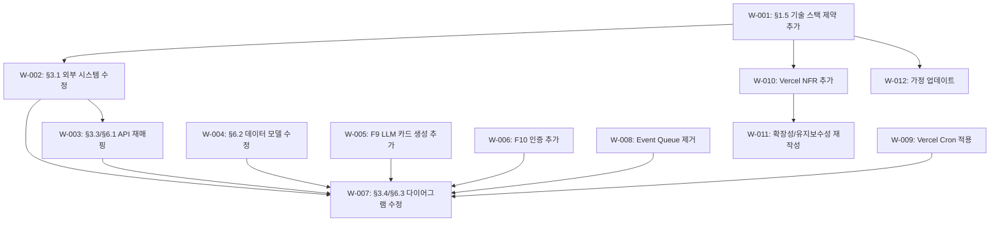

# SRS v0.2 기술 스택 정합성 변경 계획서

**문서 ID:** PLAN-SRS-002  
**작성일:** 2026-04-16  
**대상 문서:** `output/SRS-v0.1.md` → `output/SRS-v0.2.md`  
**목적:** C-TEC-001~007 기술 스택 제약을 SRS에 전면 반영하되, MVP 핵심 가치 전달이 훼손되지 않음을 검증한다.

---

## 목차

1. [변경 배경 및 원칙](#1-변경-배경-및-원칙)
2. [작업 항목 총괄](#2-작업-항목-총괄)
3. [작업 상세](#3-작업-상세)
4. [MVP 핵심 가치 훼손 검토](#4-mvp-핵심-가치-훼손-검토)
5. [작업 순서 및 의존관계](#5-작업-순서-및-의존관계)
6. [변경 후 검증 체크리스트](#6-변경-후-검증-체크리스트)

---

## 1. 변경 배경 및 원칙

### 1.1 배경

현재 SRS v0.1은 **기술 스택 비의존적(stack-agnostic)** 으로 작성되어, 마이크로서비스 분리 아키텍처, 범용 REST API 패턴, Event Queue 등 **MVP 200명 베타에 과도한 인프라 복잡도** 를 내포한다.

사용자가 확정한 기술 스택:

| 제약 ID | 핵심 내용 |
|---|---|
| C-TEC-001 | Next.js (App Router) 단일 풀스택 |
| C-TEC-002 | Server Actions / Route Handlers (별도 백엔드 없음) |
| C-TEC-003 | Prisma + SQLite (로컬) / Supabase PostgreSQL (배포) |
| C-TEC-004 | Tailwind CSS + shadcn/ui |
| C-TEC-005 | Vercel AI SDK (별도 Python 서버 없음) |
| C-TEC-006 | Google Gemini API (환경 변수로 모델 교체 가능) |
| C-TEC-007 | Vercel 배포 (Git Push 자동 배포) |

### 1.2 변경 원칙

> **핵심 원칙:**
> 1. **기능 요구사항(What)은 보존**하고, **구현 방식(How)만 변경**한다.
> 2. 사용자 관점의 핵심 가치 흐름 6가지가 변경 전후 동일하게 동작함을 검증한다.
> 3. 과도한 인프라 제거 시, 200명 베타 규모에서 동등한 품질을 보장할 수 있는 대안을 명시한다.

---

## 2. 작업 항목 총괄

| # | 작업 ID | 대상 섹션 | 변경 유형 | 우선순위 | 가치 영향 |
|---|---|---|---|---|---|
| 1 | W-001 | §1.5 Constraints | **신규 추가** — 기술 스택 제약 | Must | 없음 |
| 2 | W-002 | §3.1 External Systems | **수정** — 외부 시스템 재정의 | Must | 없음 |
| 3 | W-003 | §3.3 / §6.1 API Endpoints | **수정** — Next.js 라우팅 패턴 적용 | Must | 없음 |
| 4 | W-004 | §6.2 Data Model | **수정** — Prisma/SQLite 호환 | Must | 없음 |
| 5 | W-005 | §4.1 (신규 F9) | **신규 추가** — LLM 카드 생성 요구사항 | Must | **강화** |
| 6 | W-006 | §4.1 (신규 F10) | **신규 추가** — 인증 기능 요구사항 | Must | **강화** |
| 7 | W-007 | §3.4 / §6.3 | **수정** — 아키텍처 다이어그램 | Should | 없음 |
| 8 | W-008 | §6.3 이벤트 흐름 | **수정** — Event Queue 제거 | Should | 없음 |
| 9 | W-009 | §3.4 배치 흐름 | **수정** — Vercel Cron 적용 | Should | 없음 |
| 10 | W-010 | §4.2 NFR | **수정** — Vercel 런타임 제약 추가 | Should | 없음 |
| 11 | W-011 | §4.2.6 / §4.2.7 | **수정** — 확장성/유지보수성 재작성 | Should | 없음 |
| 12 | W-012 | §1.5 Assumptions | **수정** — 가정 업데이트 | Should | 없음 |

---

## 3. 작업 상세

### W-001: §1.5에 기술 스택 제약 섹션 추가

**대상:** §1.5.1 아키텍처 제약 → §1.5.1 "제품/ADR 제약" + 신규 §1.5.2 "기술 스택 제약" 분리

**추가 내용:**

| 제약 ID | 출처 | 제약 내용 |
|---|---|---|
| C-TEC-001 | 기술 스택 정책 | 모든 서비스는 Next.js (App Router) 기반 단일 풀스택 프레임워크로 구현한다. |
| C-TEC-002 | 기술 스택 정책 | 서버 측 로직은 Next.js Server Actions 또는 Route Handlers로 구현하며 별도 백엔드 서버를 두지 않는다. |
| C-TEC-003 | 기술 스택 정책 | 데이터베이스는 Prisma ORM을 사용하며, 로컬은 SQLite, 배포 환경은 Supabase(PostgreSQL)를 사용한다. |
| C-TEC-004 | 기술 스택 정책 | UI/스타일링은 Tailwind CSS + shadcn/ui를 사용한다. |
| C-TEC-005 | 기술 스택 정책 | LLM 오케스트레이션은 Vercel AI SDK를 사용하여 Next.js 내부에서 직접 구현한다. |
| C-TEC-006 | 기술 스택 정책 | LLM 호출은 Google Gemini API를 기본으로 하며, 환경 변수 설정만으로 모델 교체가 가능하도록 SDK 표준 인터페이스를 준수한다. |
| C-TEC-007 | 기술 스택 정책 | 배포는 Vercel 플랫폼으로 단일화하며 Git Push만으로 자동 배포한다. |

**기존 §1.5.2 보안 제약 → §1.5.3, §1.5.3 가정 → §1.5.4로 번호 재조정**

**영향 범위:** 목차 번호 조정, 이후 참조 업데이트

---

### W-002: §3.1 External Systems 수정

**변경 전:**

| 외부 시스템 | 비고 |
|---|---|
| Market Data Provider | 유지 |
| News Data Provider | 유지 |
| Community Signal Provider | 유지 |
| Push Notification Provider | 유지 |
| Auth Provider | 범용 OAuth |
| Secret Manager | 범용 SDK |

**변경 후:**

| 외부 시스템 | 유형 | 제공 데이터 | 연동 방식 | 제약 |
|---|---|---|---|---|
| Market Data Provider | 외부 데이터 소스 | OHLCV | REST + 캐시 | (유지) |
| News Data Provider | 외부 데이터 소스 | 뉴스, 감성 점수 | REST + 캐시 | (유지) |
| Community Signal Provider | 외부 데이터 소스 | 소셜 시그널 | REST + 캐시 | (유지) |
| **Google Gemini API** | **LLM 서비스** | **추천 카드 생성 (Structured Output)** | **Vercel AI SDK (`@ai-sdk/google`)** | **Rate limit, 함수당 timeout 준수, 환경 변수로 모델 교체** |
| **Supabase** | **DB 인프라 (배포)** | **PostgreSQL 호스팅, Connection Pooling** | **Prisma ORM (`@prisma/client`)** | **로컬 SQLite와 스키마 동일, 마이그레이션 Prisma Migrate** |
| Push Notification Provider | 외부 인프라 | 웹 푸시 | REST API | (유지) |
| **NextAuth.js** | **인증 라이브러리** | **소셜/이메일 로그인, JWT 세션** | **Next.js 내장 (App Router 통합)** | **Supabase 세션 테이블 또는 JWT 전략** |
| **Vercel Platform** | **배포/런타임** | **호스팅, Serverless Functions, Cron Jobs, Edge Runtime** | **Git Push 자동 배포** | **Hobby: 함수 10s timeout / Pro: 60s, Cron 최소 1일 1회(Hobby)** |
| ~~Secret Manager~~ | ~~삭제~~ | — | — | **→ Vercel Environment Variables로 대체 (CON-010과 정합)** |

---

### W-003: §3.3 / §6.1 API Endpoints 변경

**변경 원칙:**
- `/v1/` 접두사 제거 → Next.js App Router 관례 `/api/` 사용
- POST 엔드포인트 중 **클라이언트→서버 데이터 변경**은 Server Action 후보
- **Cron 배치**는 `/api/cron/` 하위로 분리
- 인증은 NextAuth.js 미들웨어로 통합

**매핑 테이블:**

| SRS v0.1 Endpoint | v0.2 변경 | 구현 방식 | 비고 |
|---|---|---|---|
| `GET /v1/recommendations/today` | `GET /api/recommendations/today` | Route Handler | 또는 Server Component 직접 호출 |
| `GET /v1/recommendations/{rec_id}` | `GET /api/recommendations/[recId]` | Route Handler | Dynamic Route |
| `POST /v1/risk-profile` | **Server Action** `saveRiskProfile()` | Server Action | 폼 액션 / `useTransition` 호출 |
| `POST /v1/events` | `POST /api/events` | Route Handler | 클라이언트 사이드 fire-and-forget |
| `POST /v1/notifications/schedule` | `GET /api/cron/morning-briefing` | **Vercel Cron** | `vercel.json` cron 설정, GET 메서드 |
| `GET /v1/performance/history` | Server Component 직접 조회 | Prisma 직접 호출 | API 불필요, RSC에서 DB 접근 |
| `GET /v1/market-ingestion/health` | `GET /api/admin/health` | Route Handler | 운영용, 인증 필수 |

**§6.1 API Endpoint List 전면 재작성 필요**

> **참고:** Server Action은 별도 URL 엔드포인트를 갖지 않으므로, §6.1 테이블에서는 "Server Action" 유형으로 표시하고 함수 시그니처를 명시한다.

---

### W-004: §6.2 Data Model — Prisma/SQLite 호환 수정

**타입 매핑 테이블:**

| SRS v0.1 타입 | 문제 | v0.2 Prisma 타입 | SQLite 호환 | PostgreSQL 호환 |
|---|---|---|---|---|
| `UUID` (PK) | SQLite native UUID 없음 | `String @id @default(cuid())` | ✅ TEXT | ✅ TEXT |
| `ENUM` (direction 등) | SQLite ENUM 미지원 | `String` + 코드 레벨 검증 (Zod) | ✅ TEXT | ✅ TEXT |
| `JSONB` (event_value) | PostgreSQL 전용 | `Json?` (Prisma) → SQLite: TEXT, PG: JSONB | ✅ | ✅ |
| `DECIMAL(12,4)` | SQLite 부동소수점 제한 | `Float` 또는 `Decimal` | ✅ REAL | ✅ NUMERIC |
| `TIMESTAMP` | — | `DateTime @default(now())` | ✅ | ✅ |
| `VARCHAR(N)` | — | `String` (Prisma 자동 매핑) | ✅ | ✅ |
| `BOOLEAN` | — | `Boolean @default(false)` | ✅ INTEGER | ✅ BOOLEAN |

**추가 변경 사항:**
- FK 관계를 Prisma `@relation` 구문으로 표현
- 제약 조건(CHECK 등)은 Prisma 스키마 + Zod 검증으로 이원화
- `user_id당 최대 3개` 같은 비즈니스 규칙은 애플리케이션 레벨(Server Action/Route Handler) 검증으로 명시
- 스키마 예시를 Prisma 형식으로 Appendix에 추가 (선택)

**모델별 변경 요약:**

| 모델 | 변경 항목 |
|---|---|
| User | `user_id: UUID` → `id: String @id @default(cuid())`, `signup_channel: VARCHAR` → `signupChannel: String` |
| RiskProfile | `user_id: UUID FK` → `userId: String @unique`, `risk_mode: ENUM` → `riskMode: String` |
| Watchlist | PK 변경, ENUM 없음, `CHECK` → Zod 검증 |
| RecommendationCard | 전 필드 타입 매핑, `ENUM` → `String`, `DECIMAL` → `Float` |
| EvidenceSnapshot | 타입 매핑만 (구조 변경 없음) |
| PerformanceRecord | 타입 매핑만 |
| NotificationLog | `ENUM` → `String` 매핑 |
| EventLog | `JSONB` → `Json?`, 나머지 타입 매핑 |

---

### W-005: LLM 카드 생성 기능 요구사항 신설

**위치:** §4.1에 **F9. LLM 기반 추천 카드 생성** 섹션 추가

> **중요:** 현재 SRS v0.1에서 **가장 큰 기능적 갭**. "Card Engine"이 추천 카드를 어떻게 생성하는지 전혀 명세되어 있지 않아, 구현 시 해석 여지가 과도하다.

**신규 요구사항:**

| REQ ID | 요구사항 설명 | Priority | AC 요약 |
|---|---|---|---|
| REQ-FUNC-080 | 시스템은 Vercel AI SDK를 통해 Google Gemini API를 호출하여 추천 카드를 생성해야 한다. | M | Gemini API 호출 → RecommendationCard 스키마 준수 JSON 반환 |
| REQ-FUNC-081 | LLM 출력은 Structured Output (JSON Schema) 형식으로 강제되어야 하며, 카드 스키마(`ticker`, `direction`, `entry_price`, `target_price`, `hold_days`, `confidence_score`, `reason_line`)에 100% 적합해야 한다. | M | 스키마 불일치 시 재시도 1회, 실패 시 No Call |
| REQ-FUNC-082 | LLM 프롬프트에는 사용자 watchlist, 시장 데이터 요약, 뉴스 시그널, risk_mode가 컨텍스트로 포함되어야 한다. | M | 입력 데이터 4종이 프롬프트에 포함됨을 로그로 확인 가능 |
| REQ-FUNC-083 | LLM 호출 실패(API 에러, timeout, rate limit) 시 시스템은 No Call 상태 카드를 반환하고 `llm_call_failed` 이벤트를 기록해야 한다. | M | 5xx/timeout 시 No Call 반환, 이벤트 기록, 사용자에게 에러 화면 미노출 |
| REQ-FUNC-084 | `GEMINI_MODEL` 환경 변수 변경만으로 LLM 모델을 교체할 수 있어야 하며, 출력 스키마 호환성은 유지되어야 한다. | S | 환경 변수 변경 후 재배포 시 동일 스키마 카드 생성 확인 |
| REQ-FUNC-085 | LLM 응답에 투자 자문으로 오해될 수 있는 표현이 포함될 경우, 시스템 프롬프트에서 "투자 참고용 정보이며 투자 자문이 아님" 면책 조항을 강제해야 한다. | M | reason_line에 면책 미포함 시에도, 카드 UI 하단에 고정 면책 문구 표시 |

---

### W-006: 인증 기능 요구사항 신설

**위치:** §4.1에 **F10. 사용자 인증** 섹션 추가

| REQ ID | 요구사항 설명 | Priority | AC 요약 |
|---|---|---|---|
| REQ-FUNC-090 | 시스템은 NextAuth.js를 사용하여 이메일 또는 소셜 로그인(Google, Kakao 중 1개 이상)을 제공해야 한다. | M | 로그인 성공 시 세션 토큰 발급, 홈 리다이렉트 |
| REQ-FUNC-091 | 인증되지 않은 사용자가 보호된 페이지에 접근하면, 로그인 페이지로 리다이렉트해야 한다. | M | Next.js Middleware에서 세션 검증 → 미인증 시 `/login` 리다이렉트 |
| REQ-FUNC-092 | 세션은 JWT 기반으로 관리하며, 세션 만료 시 자동 갱신(refresh) 또는 재로그인 유도가 이루어져야 한다. | S | 세션 만료 시 UX 단절 없이 처리 |
| REQ-FUNC-093 | 사용자 탈퇴 시 관련 데이터(watchlist, risk_profile, event_log)가 삭제 또는 익명화되어야 한다. | S | GDPR/개인정보 보호 기준 |

---

### W-007: §3.4 / §6.3 아키텍처 다이어그램 변경

**변경 원칙:** 별도 서비스 간 네트워크 호출 → Next.js 내부 모듈 호출로 변경

**Before (v0.1) — 추천 카드 조회:**
```
User → ClientApp → RecAPI → RiskProfileStore → Cache → CardEngine → RecAPI → ClientApp
```

**After (v0.2) — 추천 카드 조회:**
```
User → Next.js Page (RSC)
  → Server Action / Route Handler
    → Prisma: user.riskMode 조회
    → Prisma: watchlist 조회
    → fetch: Market/News API (캐시)
    → Vercel AI SDK: Gemini 호출 (Structured Output)
    → Prisma: RecommendationCard 저장
  → Client Component: 카드 렌더링
```

**변경 대상 다이어그램:**

| 다이어그램 | 변경 내용 |
|---|---|
| §3.4.1 추천 카드 조회 | RecAPI, RiskProfileStore, Cache, CardEngine → 내부 함수 호출 + Prisma + AI SDK |
| §3.4.2 Confidence Score 변경 | RiskProfileAPI → Server Action, RecAPI → Route Handler |
| §3.4.3 아침 브리핑 | Batch Scheduler → Vercel Cron |
| §6.3.1 전체 데이터 흐름 | Feature Builder, Orchestrator, Confidence Engine → 내부 모듈 |
| §6.3.2 카드 생성/검증 | Scheduler → Cron, EventBus → Prisma direct write |
| §6.3.3 성과 이력 | 구조 유지 (내부 호출로 표현 변경) |
| §6.3.4 푸시 발송 | Scheduler → Cron, 내부 호출 형상 |
| §6.3.5 이벤트/KPI | Event Queue 제거, Prisma 직접 write |

---

### W-008: Event Queue 제거

**근거:** 200명 베타 규모에서 Event Queue(Kafka, SQS 등)는 과도한 인프라.

| 변경 전 | 변경 후 |
|---|---|
| `ClientApp → EventAPI → EventQueue → EventStore` | `ClientApp → POST /api/events → Prisma.eventLog.create()` |
| 별도 Queue Consumer 필요 | 직접 DB write (fire-and-forget) |
| 누락률 관리: Queue 기반 | 누락률 관리: 클라이언트 retry (1회) + `navigator.sendBeacon` fallback |

**NFR 영향:** REQ-NF-014 (이벤트 누락률 < 1%) — 달성 방법을 "클라이언트 사이드 retry + sendBeacon"으로 변경

---

### W-009: Batch Scheduler → Vercel Cron

**변경 내용:**

| 항목 | v0.1 | v0.2 |
|---|---|---|
| 스케줄러 | 범용 Batch Scheduler | Vercel Cron (`vercel.json` 설정) |
| 트리거 | POST 내부 호출 | GET `/api/cron/morning-briefing` (Vercel이 호출) |
| 인증 | 내부 서비스 인증 | `CRON_SECRET` 환경 변수 검증 |
| 실행 시간 제약 | 미명시 | Hobby: 10s / Pro: 60s (초과 시 분할 처리 필요) |
| 최소 주기 | 미명시 | Hobby: 1일 1회 / Pro: 1시간 1회 |

**배치 카드 생성 대응:**
- 200명 × 최대 3 카드 = 최대 600 Gemini API 호출
- Vercel Pro 60s 내 처리 불가 시 → **Edge Function 스트리밍** 또는 **사전 배치 분할**(Cron → Queue 패턴은 추후 확장 시)
- MVP 대안: 카드 사전 생성을 하지 않고, **사용자 접속 시 On-demand 생성 + 캐싱** 전략 (§4.2 NFR에 반영)

---

### W-010: Vercel 런타임 제약 NFR 추가

**§4.2에 추가할 요구사항:**

| REQ ID | 항목 | 요구사항 | Source |
|---|---|---|---|
| REQ-NF-070 | Serverless Function Timeout | Route Handler 및 Server Action의 실행 시간은 Vercel Plan 제한(Hobby: 10s, Pro: 60s)을 초과하지 않도록 설계한다. LLM 호출이 포함된 함수는 스트리밍 응답을 사용한다. | C-TEC-001, C-TEC-007 |
| REQ-NF-071 | Cold Start 대응 | Serverless Function cold start로 인한 초기 응답 지연을 감안하여, 추천 카드 API의 p95 800ms 기준은 warm 상태 기준으로 측정한다. | C-TEC-007 |
| REQ-NF-072 | 데이터베이스 연결 관리 | Prisma Client는 Vercel Serverless 환경에서 연결 풀 고갈을 방지하기 위해 Connection Pooling(Supabase Pooler 또는 Prisma Accelerate)을 사용한다. | C-TEC-003, C-TEC-007 |
| REQ-NF-073 | 번들 사이즈 | 클라이언트 JavaScript 번들 크기는 First Load JS 기준 150KB 이하를 목표로 한다. | C-TEC-004 (shadcn/ui tree-shaking) |

---

### W-011: 확장성/유지보수성 재작성

**§4.2.6 확장성 변경:**

| REQ ID | v0.1 | v0.2 |
|---|---|---|
| REQ-NF-050 | 배치 완료 시간 내 전체 카드 생성 | On-demand 생성 + 캐싱 또는 Cron 사전 생성 (200명 기준) |
| REQ-NF-051 | 동시 세션 급증 시 누락률 유지 | Vercel 자동 스케일링 기반, 누락률 < 1% |
| REQ-NF-052 | 수평 확장 가능 구조 설계 | **삭제** — Vercel Serverless가 자동 수평 확장. 별도 설계 불필요 |

**§4.2.7 유지보수성 변경:**

| REQ ID | v0.1 | v0.2 |
|---|---|---|
| REQ-NF-060 | `/v1/` API 버전 관리 | **삭제** — MVP 단일 버전, Next.js 내부 라우팅에 API 버전 불필요 |
| REQ-NF-061 | 배포 파이프라인 보안 스캔 | Vercel 배포 시 환경 변수 암호화 확인 (유지, 표현 변경) |
| REQ-NF-062 | 스키마 리뷰 | Prisma Migrate 기반 스키마 변경 이력 관리 (유지, 표현 변경) |

---

### W-012: §1.5.4 가정(Assumptions) 업데이트

| 가정 ID | v0.1 | v0.2 |
|---|---|---|
| ASS-006 | 지연 허용형 캐시로 공급 | Next.js `fetch` 캐시 (`revalidate`) 또는 `unstable_cache`로 구현 |
| ASS-007 | 모바일 웹 푸시 공급자 | Web Push API + Service Worker 기반, Vercel 호스팅 환경에서 동작 |
| ASS-008 | 이메일 또는 소셜 로그인 | **NextAuth.js** 기반 Google/Kakao OAuth 또는 이메일 링크 로그인 |
| **ASS-009 (신규)** | — | Vercel Hobby Plan 기준으로 MVP를 운영하며, 필요 시 Pro Plan으로 전환한다 |
| **ASS-010 (신규)** | — | SQLite(로컬)와 PostgreSQL(Supabase) 간 Prisma 스키마 호환성이 유지된다 |

---

## 4. MVP 핵심 가치 훼손 검토

### 4.1 검토 프레임워크

PRD에서 정의한 MVP 핵심 가치 = **"실행 가능한 숫자와 확신을 5분 안에 제공"**

이 가치는 **6가지 핵심 사용자 경험 흐름**으로 구체화된다. 각 흐름에 대해 기술 스택 변경이 기능적 결과(What)를 변경하는지 검증한다.

### 4.2 흐름별 검토 결과

#### 흐름 1: 온보딩 — 관심 종목 등록 🟢

| 항목 | 검토 |
|---|---|
| **사용자 경험** | 종목/섹터 1~3개 선택 → 저장 → 홈 이동 |
| **v0.1 구현** | REST API POST → DB 저장 |
| **v0.2 구현** | Server Action `saveWatchlist()` → Prisma `watchlist.create()` |
| **가치 변화** | **없음** — 사용자 입장에서 동일한 선택 → 저장 → 이동 경험 |
| **오히려 개선** | Server Action은 네트워크 왕복 1회 감소 (API 엔드포인트 없이 직접 호출) |

#### 흐름 2: 홈 화면 — 오늘의 추천 카드 확인 🟢

| 항목 | 검토 |
|---|---|
| **사용자 경험** | 홈 진입 → 카드 1~3장 확인 (ticker, direction, price, hold_days, confidence, reason) |
| **v0.1 구현** | GET /v1/recommendations/today → CardEngine → 응답 |
| **v0.2 구현** | Server Component → Prisma(캐시 카드 조회) 또는 Route Handler → Vercel AI SDK(Gemini) → 카드 생성/반환 |
| **가치 변화** | **없음** — 출력되는 카드 형식/필드 완전 동일 |
| **오히려 개선** | RSC(Server Component) 기반 렌더링으로 초기 로드 시 클라이언트 JS 최소화 → **체감 속도 향상** |

> **참고:** v0.2에서는 LLM 카드 생성 요구사항(W-005)이 추가되므로, "Card Engine이 어떻게 카드를 만드는가"가 명확해져 오히려 **구현 정합성이 강화**된다.

#### 흐름 3: Confidence Score 조작 → 카드 값 변경 🟢

| 항목 | 검토 |
|---|---|
| **사용자 경험** | 슬라이더/토글 변경 → 카드 price/hold_days 즉시 반영 (≤300ms) |
| **v0.1 구현** | POST /v1/risk-profile → GET /v1/recommendations/today |
| **v0.2 구현** | Server Action `saveRiskProfile()` → Prisma 저장 → `revalidatePath('/')` 또는 클라이언트 상태 갱신 |
| **가치 변화** | **없음** — 300ms UI 반영 기준 동일 유지 |
| **주의점** | Gemini 재호출 없이 기 생성된 3벌 카드(aggressive/balanced/conservative) 중 선택하는 전략이 필요 → W-005 REQ-FUNC-082에서 "risk_mode별 3벌 생성" 패턴으로 커버 |

#### 흐름 4: 가격 복사 / 브로커 이동 — 실행 전환 🟢

| 항목 | 검토 |
|---|---|
| **사용자 경험** | 가격 복사 버튼 → 클립보드 복사, 브로커 이동 → 외부 앱 |
| **v0.1 구현** | 클라이언트 이벤트 → POST /v1/events |
| **v0.2 구현** | 클라이언트 이벤트 → `POST /api/events` (Route Handler) → Prisma |
| **가치 변화** | **없음** — 순수 클라이언트 액션 + 이벤트 로깅, 기술 스택 무관 |

#### 흐름 5: Trust Layer — 성과 이력 확인 🟢

| 항목 | 검토 |
|---|---|
| **사용자 경험** | 추천 상세 → 과거 성과 기록 (성공+실패) 확인 |
| **v0.1 구현** | GET /v1/recommendations/{rec_id} → PerformanceStore 조회 |
| **v0.2 구현** | Server Component → Prisma `performanceRecord.findMany()` 직접 조회 |
| **가치 변화** | **없음** — 동일한 데이터, 동일한 표시 |
| **오히려 개선** | RSC 직접 DB 접근으로 네트워크 홉 1단계 감소, API 중간 레이어 불필요 |

#### 흐름 6: 아침 브리핑 푸시 🟡

| 항목 | 검토 |
|---|---|
| **사용자 경험** | 미국장 전 푸시 수신 → 탭 → 카드 화면 랜딩 |
| **v0.1 구현** | Batch Scheduler → Notification API → Push Provider |
| **v0.2 구현** | Vercel Cron → `/api/cron/morning-briefing` → Push Provider |
| **가치 변화** | **기능 동일** |
| **주의점** | ⚠️ **Vercel Hobby Plan**: Cron 최소 주기 1일 1회, 함수 timeout 10s. 200명 개별 푸시 발송이 10s 내 완료 불가 시 **Pro Plan 필요** 또는 **외부 Push Service(OneSignal 등)에 일괄 위임** 전략 필요 |

### 4.3 검토 결론

```
┌─────────────────────────────────────────────────────────────────────┐
│  MVP 핵심 가치 훼손 여부: ❌ 훼손 없음                                 │
│                                                                     │
│  • 6개 핵심 흐름 중 5개: 기능 동일 또는 개선                              │
│  • 1개 (푸시 알림): 기능 동일, 단 Vercel Plan 제약에 대한 대응 전략 필요     │
│                                                                     │
│  부가 효과:                                                           │
│  ✅ LLM 카드 생성 요구사항 추가로 구현 명확성 강화                         │
│  ✅ 인증 요구사항 추가로 보안 커버리지 강화                               │
│  ✅ 인프라 복잡도 감소 (Queue, 별도 서비스 제거)                           │
│  ✅ 개발 속도 향상 (단일 프레임워크, 단일 배포)                            │
│                                                                     │
│  유의 사항:                                                           │
│  ⚠️ 푸시 배치 발송: Vercel timeout 내 처리 전략 확정 필요                  │
│  ⚠️ Gemini API Rate Limit: 200명 동시 카드 생성 시 RPM 확인 필요          │
│  ⚠️ SQLite→PostgreSQL 마이그레이션: 첫 배포 전 검증 필요                  │
└─────────────────────────────────────────────────────────────────────┘
```

---

## 5. 작업 순서 및 의존관계



**권장 실행 순서:**

| Phase | 작업 | 설명 |
|---|---|---|
| Phase 1 | W-001, W-012 | 제약/가정 기반 확립 (다른 작업의 근거) |
| Phase 2 | W-002, W-004, W-005, W-006 | 외부 시스템, 데이터 모델, 신규 FR 추가 (병렬 가능) |
| Phase 3 | W-003, W-008, W-009, W-010 | API/이벤트/Cron/NFR 변경 |
| Phase 4 | W-007, W-011 | 다이어그램 및 확장성 최종 정합 (모든 변경 반영 후) |

---

## 6. 변경 후 검증 체크리스트

변경 완료 후 SRS v0.2가 아래 기준을 모두 충족하는지 검증한다.

### 6.1 기술 스택 정합성

- [ ] C-TEC-001~007 7개 제약이 §1.5에 명시되어 있다
- [ ] §3.1 외부 시스템에 Gemini API, Supabase, Vercel, NextAuth.js가 포함되어 있다
- [ ] "별도 백엔드 서버", "마이크로서비스", "Event Queue" 등 불일치 표현이 제거되었다
- [ ] API 엔드포인트가 `/api/` 패턴 또는 Server Action으로 표현되어 있다
- [ ] 데이터 모델이 SQLite/PostgreSQL 이중 호환이다
- [ ] `/v1/` 접두사가 제거되었다

### 6.2 기능적 완전성

- [ ] F1~F8 기존 요구사항이 모두 보존되어 있다 (REQ-FUNC-001 ~ 070)
- [ ] F9 LLM 카드 생성 요구사항이 추가되었다 (REQ-FUNC-080 ~ 085)
- [ ] F10 인증 요구사항이 추가되었다 (REQ-FUNC-090 ~ 093)
- [ ] Traceability Matrix에 신규 REQ가 반영되었다

### 6.3 MVP 가치 보전

- [ ] 6가지 핵심 사용자 흐름이 v0.1과 동일한 기능적 결과를 보장한다
- [ ] 푸시 배치 발송의 Vercel timeout 대응 전략이 명시되어 있다
- [ ] Gemini API 실패 시 No Call fallback이 명세되어 있다

### 6.4 아키텍처 다이어그램 일관성

- [ ] 시퀀스 다이어그램의 participant가 Next.js 내부 모듈/함수로 표현되어 있다
- [ ] 데이터 흐름도가 단일 앱 아키텍처를 반영한다
- [ ] Vercel Cron이 배치 스케줄러로 표현되어 있다

---

*End of Plan PLAN-SRS-002*
